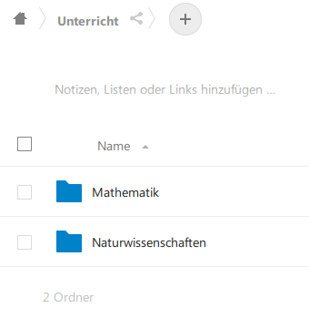
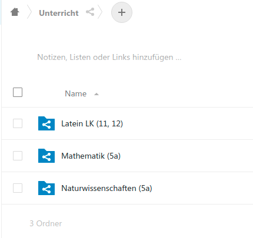
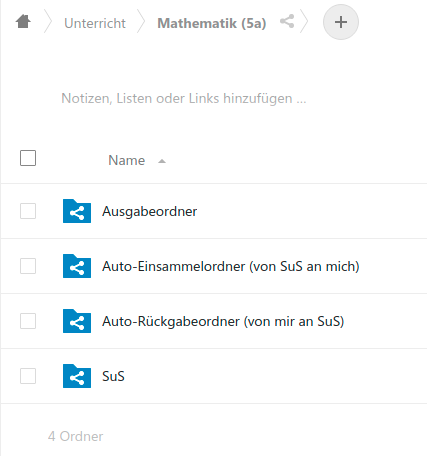
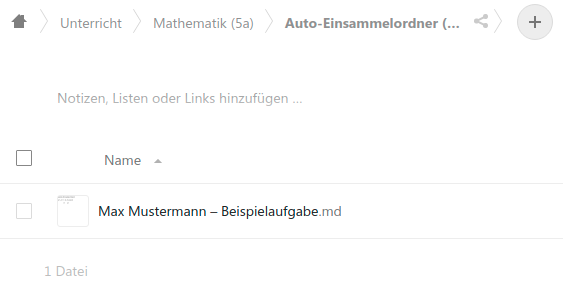
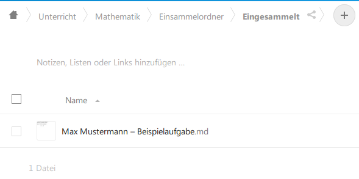
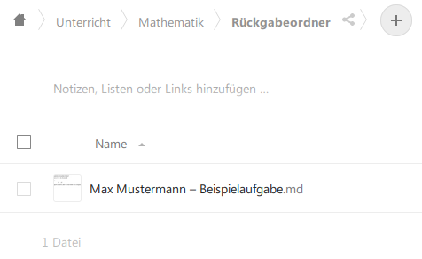

# Nextcloud

## Einrichtung

Die grundsätzliche Einrichtung der Nextcloud für unsere Beispielumgebung 
ist in [Installationsanweisung](Installation.md) beschrieben.

## Pflege bei Änderung der Stammdaten

[Dort](Installation.md) steht auch, welche Skripte  erneut gestartet 
werden müssen, wenn neue Benutzer oder neue Fächer eingerichtet dazu 
kommen oder sich die Zuordnung von Fächern zu Lehrern und Schülern 
ändert.

## Ordnerstruktur in der Nextcloud

Zunächst wurde durch das o.g. Setup für einen User "Dashboard" ein 
kompletter Ordnerbaum unterhalb von `Unterricht` eingerichtet, der 
alle Kurse und Schüler und Schülerinnen abbildet.

```
 Unterricht
...
 ├── Ma~2a
 │   ├── Ausgabeordner
 │   │   └── test.md
 │   ├── Auto-Einsammelordner (von SuS an mich)
 │   ├── Auto-Rückgabeordner (von mir an SuS)
 │   └── SuS
 │       ├── Elli Mustermann
 │       │   ├── Einsammelordner
 │       │   │   └── Eingesammelt
 │       │   └── Rückgabeordner
 │       ├── Mallory Mustermann
 │       │   ├── Einsammelordner
 │       │   │   └── Eingesammelt
 │       │   └── Rückgabeordner
 │       └── Max Mustermann
 │           ├── Einsammelordner
 │           │   ├── Eingesammelt
 │           │   └── test.md
 │           └── Rückgabeordner
 └── Nawi~6a
     ├── Ausgabeordner
     ├── Auto-Einsammelordner (von SuS an mich)
     ├── Auto-Rückgabeordner (von mir an SuS)
     └── SuS
         ├── Elli Mustermann
         │   ├── Einsammelordner
         │   │   └── Eingesammelt
         │   └── Rückgabeordner
         ├── Mallory Mustermann
         │   ├── Einsammelordner
         │   │   └── Eingesammelt
         │   └── Rückgabeordner
         └── Max Mustermann
             ├── Einsammelordner
             │   └── Eingesammelt
             └── Rückgabeordner
```

Diese Ordner werden dann jeweils mit allen Beteiligten geteilt, so 
dass jede Lehrkraft klassenübergreifend Zugriff auf ihre Fächer und 
SuS hat und alle SuS Zugriff auf ihre eigenen Fächer nach Stundenplan.


### Schülersicht

Die SuS sehen in ihrer Nextcloud unterhalb von "Unterricht" eine Liste ihrer Fächer.



In jedem dieser Ordner liegen die o.g. Verknüpfungen:


| Ordner          | Bedeutung                                                                   |
| --------------- | --------------------------------------------------------------------------- |
| Ausgabeordner   | Hier liegen die von den Lehrkräften bereitgestellten Unterlagen             | 
| Einsammelordner | Hier legen die SuS ihre Daten für die Lehrer ab                             |
|  - Eingesammelt | Hierhin werden die Daten nach dem Einsammeln verschoben                     |
| Rückgabeordner  | Hier liegen die Rückmeldungen der Lehrkräfte zu eingesammelten Aufgaben     |


### Lehrersicht

Die Lehrkräfte sehen in ihrer Unterrichtsübersicht Verknüpfungen auf 
ihre Kurse (je Fach und Lerngruppe).



Innerhalb dieser Ordner finden sie folgende Verknüpfungen:




| Ordner               | Bedeutung                                                                   |
| -------------------- | --------------------------------------------------------------------------- |
| Ausgabeordner        | Hier stellen die Lehrkräfte die Unterlagen für die SuS bereit               |
| Auto-Einsammelordner | Hier werden die abgegebenen Unterlagen der SuS eingesammelt                 |
| Auto-Rückgabeordner  | Hier können Lehrkräfte Feedback zu eingesammelten Aufgaben abgeben          |
|  - Zurückgegeben     | Hierhin werden die Daten nach dem Zurückgeben an die SuS verschoben         |
| SuS                  | Hier haben Lehrkräfte direkten Zugriff auf Einsammel/Rückgabe einzelner SuS |


### Ablauf 

Hinter den oben beschriebenen Ordnern liegt folgende Logik:

1. Der Lehrer stellt in seinem Kurs im *Ausgabeordner* Aufgaben und ggf. Zusatzmaterial zur Verfügung
2. Die SuS laden die Unterlagen aus ihrem *Ausgabeordner* und bearbeiten sie
3. Die SuS laden ihre Arbeitsergebnisse in ihren *Einsammelordner* hoch
4. Ein Job sammelt die Arbeitsergebnisse aller SuS ein
   a. und stellt sie der Lehrkraft in deren *Auto-Einsammelordner (von SuS an mich)* zur Verfügung
   b. und verschiebt sie beim Schüler in den Unterordner *Eingesammelt*
5. Wenn die Lehrkraft Feedback für die SuS hat, wird dieses in den *Auto-Rückgabeordner (von mir an SuS* gelegt
6. Ein Job verteilt dieses Feedback an die *Rückgabeordner* der Schüler


### Beispiel

In diesem Beispiel hat der Lehrer Herr Clarke in dem Ausgabeordner 
für Mathematik in der 5a einen Test in Form der Datei `Beispielaufgabe.md` 
zur Verfügung gestellt (Schritt 1).

Alle SuS der Klasse 5a finden diese Datei in ihrem Ausgabeordner unter dem Fach Mathematik
und können die Datei herunterladen und bearbeiten (Schritt 2).

Max Mustermann ist mit seiner Aufgabe fertig und lädt die Ergebnisse unter dem 
Namen `Beispielaufgabe.md` in seinen *Einsammelordner* hoch (Schritt 3).

Solange kein automatischer Job läuft, müssen wir einzelne Schritte manuell ausführen, hier das Einsammeln der abgegebenen Dateien (Schritt 4).

```{.bash}
$ ./collect-nextcloud-files-from-sus.rb --srsly | docker exec -i schuldashboarddev_nextcloud_1 ruby -

Checking for files to collect...
cp -al [/var/www/html/data/dashboard/files/Unterricht/Ma~2a/SuS/Max Mustermann/Einsammelordner/Beispielaufgabe.md] => [/var/www/html/data/dashboard/files/Unterricht/Ma~2a/Auto-Einsammelordner (von SuS an mich)/Max Mustermann – Beispielaufgabe.md]
mv [/var/www/html/data/dashboard/files/Unterricht/Ma~2a/SuS/Max Mustermann/Einsammelordner/Beispielaufgabe.md] => [/var/www/html/data/dashboard/files/Unterricht/Ma~2a/SuS/Max Mustermann/Einsammelordner/Eingesammelt/Max Mustermann – Beispielaufgabe.md]
Checking for files to hand out...
Refreshing dashboard/files/Unterricht/Ma~2a/Auto-Einsammelordner (von SuS an mich)
Starting scan for user 1 out of 1 (dashboard)
        Folder  /dashboard/files/Unterricht/Ma~2a/Auto-Einsammelordner (von SuS an mich)
        File    /dashboard/files/Unterricht/Ma~2a/Auto-Einsammelordner (von SuS an mich)/Max Mustermann – Beispielaufgabe.md

+---------+-------+--------------+
| Folders | Files | Elapsed time |
+---------+-------+--------------+
| 1       | 1     | 00:00:00     |
+---------+-------+--------------+
Refreshing dashboard/files/Unterricht/Ma~2a/SuS/Max Mustermann/Einsammelordner
Starting scan for user 1 out of 1 (dashboard)
        Folder  /dashboard/files/Unterricht/Ma~2a/SuS/Max Mustermann/Einsammelordner
        Folder  /dashboard/files/Unterricht/Ma~2a/SuS/Max Mustermann/Einsammelordner/Eingesammelt
        File    /dashboard/files/Unterricht/Ma~2a/SuS/Max Mustermann/Einsammelordner/Eingesammelt/Max Mustermann – Beispielaufgabe.md

+---------+-------+--------------+
| Folders | Files | Elapsed time |
+---------+-------+--------------+
| 2       | 1     | 00:00:00     |
+---------+-------+--------------+
```

Dabei sehen wir, dass Die eingesammelte Aufgabe automatisch umbenannt und um den Schülernamen ergänzt wurde (`Max Mustermann - Beispielaufgabe.md`). Dadurch sind die Dokumente unterschiedlich benannt, falls mehrere Schüler ihre Lösung unter demselben Namen ablegen, und die Lehrkraft sieht auf den ersten Blick, was von wem kommt.





Die Lehrkraft kann nun Feedback zu den Aufgaben geben. Nach Möglichkeit behält er dabei direkt den automatisch vergebenen Namen, so dass das System beim Verteilen die Zuordnung zu den SuS findet (Schritt 5).

Zuletzt wird dieses Feedback aus dem Rückgabeordner der Lehrkraft an alle SuS verteilt (Schritt 6). Hierbei kommt dasselbe Skript wie beim Einsammeln zum Einsatz.

```{.bash}
$ ./collect-nextcloud-files-from-sus.rb --srsly | docker exec -i schuldashboarddev_nextcloud_1 ruby -
Checking for files to collect...
Checking for files to hand out...
[Max Mustermann – Beispielaufgabe.md] found match: Max Mustermann
cp -al [/var/www/html/data/dashboard/files/Unterricht/Ma~2a/Auto-Rückgabeordner (von mir an SuS)/Max Mustermann – Beispielaufgabe.md] => [/var/www/html/data/dashboard/files/Unterricht/Ma~2a/SuS/Max Mustermann/Rückgabeordner/Max Mustermann – Beispielaufgabe.md]
Checking: /var/www/html/data/dashboard/files/Unterricht/Ma~2a/Auto-Rückgabeordner (von mir an SuS)/Zurückgegeben
md [/var/www/html/data/dashboard/files/Unterricht/Ma~2a/Auto-Rückgabeordner (von mir an SuS)/Zurückgegeben]
mv [/var/www/html/data/dashboard/files/Unterricht/Ma~2a/Auto-Rückgabeordner (von mir an SuS)/Max Mustermann – Beispielaufgabe.md] => [/var/www/html/data/dashboard/files/Unterricht/Ma~2a/Auto-Rückgabeordner (von mir an SuS)/Zurückgegeben/Max Mustermann – Beispielaufgabe.md]
Refreshing dashboard/files/Unterricht/Ma~2a/Auto-Rückgabeordner (von mir an SuS)
Starting scan for user 1 out of 1 (dashboard)
        Folder  /dashboard/files/Unterricht/Ma~2a/Auto-Rückgabeordner (von mir an SuS)
        Folder  /dashboard/files/Unterricht/Ma~2a/Auto-Rückgabeordner (von mir an SuS)/Zurückgegeben
        File    /dashboard/files/Unterricht/Ma~2a/Auto-Rückgabeordner (von mir an SuS)/Zurückgegeben/Max Mustermann – Beispielaufgabe.md

+---------+-------+--------------+
| Folders | Files | Elapsed time |
+---------+-------+--------------+
| 2       | 1     | 00:00:00     |
+---------+-------+--------------+
Refreshing dashboard/files/Unterricht/Ma~2a/SuS/Max Mustermann/Rückgabeordner
Starting scan for user 1 out of 1 (dashboard)
        Folder  /dashboard/files/Unterricht/Ma~2a/SuS/Max Mustermann/Rückgabeordner
        File    /dashboard/files/Unterricht/Ma~2a/SuS/Max Mustermann/Rückgabeordner/Max Mustermann – Beispielaufgabe.md

+---------+-------+--------------+
| Folders | Files | Elapsed time |
+---------+-------+--------------+
| 1       | 1     | 00:00:00     |
+---------+-------+--------------+
```

Dabei sehen wir, dass die zurück gegebenen Dateien auf Seite des Lehrers in den Unterordner *Zurückgegeben* verschoben wurden und bei Max Mustermann in seinem Rückgabeordner auftauchen.



